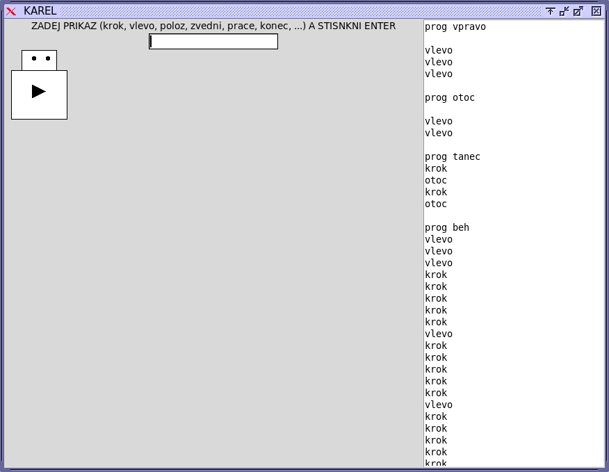
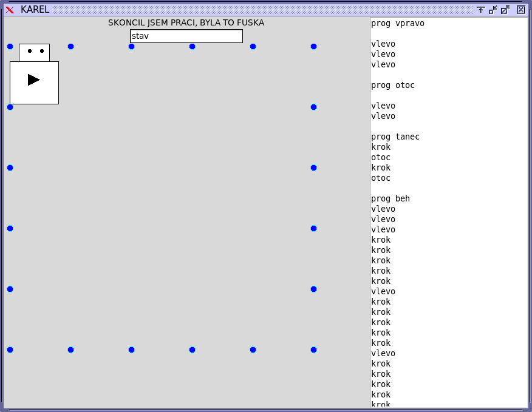

# KAREL - a famous Czech program to learn programming

Originaly (80s), KAREL ran on PMD-80 computers.
Today, it is easy to implement it in Python.
KAREL looks like this:

After it performs a work ("prace"), it complains it was a lot of work ("fuska"):

